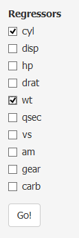
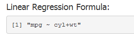

## Introduction

1. Shiny App
2. 'mtcars' dataset
3. Linear Regression
3. Running the App

--- .class #id 
## Shiny App
1. A 'Shiny' app is used to build the user interface to study 'mtcars' dataset.
2. The objective is to study the impact of certain aspects of the car designs on fuel consumption.
3. This app helps the user to perform quick first pass analysis to determine the possible
   regressors.
4. A 'Shiny' app can be built with minimal effort.

--- .class #id 
## 'mtcars' dataset
1. The 'mtcars' dataset has 11 variables.
```{r echo=FALSE} 
names(mtcars)
```
A data frame with 32 observations on 11 variables.

 Abbrev.  |  Description
 ---------|--------------------------------------------
 mpg      |  Miles/(US) gallon                        
 cyl      |  Number of cylinders                      
 disp     |  Displacement (cu.in.)                    
 hp       |  Gross horsepower                        
 drat     |  Rear axle ratio                        
 wt       |  Weight (lb/1000)                      
 qsec     |  1/4 mile time                        
 vs       |  V/S                                 
 am       |  Transmission (0 = automatic, 1 = manual)
 gear     |  Number of forward gears            
 carb     |  Number of carburetors             

--- .class #id 
## Linear Regression

--- .class #id 
## Running the App



--- .class #id 
## Results
1. The output panel consists of
  + Coefficients of linear regression
  + Residual Plots
2. The coefficients show which regressors are significant.
3. The residual plots give an indication of the 'correctness' of the model.


