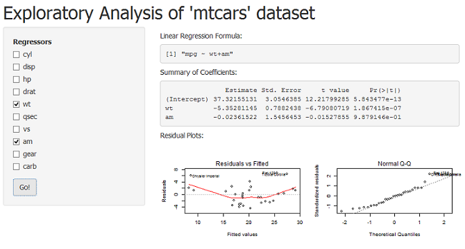

## Shiny App and 'mtcars' Dataset
1. A 'Shiny' (http://shiny.rstudio.com) app is used to build the user interface to study 'mtcars' dataset.
2. The objective is to study the impact of certain aspects of the car designs on fuel consumption.
3. In this app, regression analysis is carried out to predict a response variable (mpg) from one or more
   predictor variables or regressors for the 'mtcars' dataset.
   + We want to know the potential regressors that can explain any observable differences in fuel consumption.
4. The 'mtcars' dataset has 11 variables.


```
##  [1] "mpg"  "cyl"  "disp" "hp"   "drat" "wt"   "qsec" "vs"   "am"   "gear"
## [11] "carb"
```

--- .class #id 
## User Interface


--- .class #id 
## Running the App
1. Open the "server.R" or "ui.R" file from R Studio
2. Click on "Run App" button to launch the application.
3. Select one or more regressors/predictors.
   + The formula for linear regression will be displayed.
4. Click on "Go!" Button to generate the regression coefficients and residual plots.
5. The output panel consists of
   + Coefficients of linear regression
   + Residual Plots
6. The coefficients show which regressors may be significant in explaining the model.
7. The residual plots give an indication of the 'correctness' of the model.

--- .class #id 
## Conclusions
* This is a simple illustration of developing data products using 
  + Shiny App to create the user interface
  + Slidify (http://slidify.github.io) to pitch about the data product.
* Developers can dedicate more time on the research topics, and make use of these
  efficient tools to produce impressive presentations/products.

### Note: This presentation deck is built using "Slidify".


